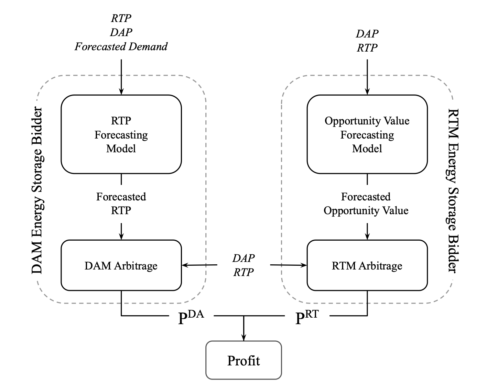

# Energy Storage Arbitrage in Two Settlement Markets

This readme file will guide you through the repo files.

The repo has all the main codes for the experiments shown in the paper

As shown in the figure, our framework consists of a DAM bidding stage and sequential RTM bidding stages on a daily basis.
The DAM stage uses the predicted hourly average real-time price as the charge and discharge bid for the same hour in DAM. The RTM stage designs real-time bids sequentially for each hour.

- `experiment_notebook.ipynb` This notebook goes through the full pipeline from data processing, model training, to results generation.

- `main_utils.py` this python file has all the functions needed to run the notebook successfully.

- `Dataset` folder:
This folder contains the dataset we used in our experiments, it was collected from NYISO website.
        
- `RTP_Forecasting_Model` folder:
This folder contains the source files for the real-time price forecasting model used in this study, multiple scripts has been added to train all the models included in the study.
Make sure to edit the script to modify the root path to the dataset: `root_path_name=/path/to/PSCC_Code_Repo/dataset`
    
- `RTM_results` folder:
This folder contains the solutions generated for the RTM bidding stage, it was mostly based on this repo: https://github.com/ybaker661/LSTM-Value-Prediction
    
